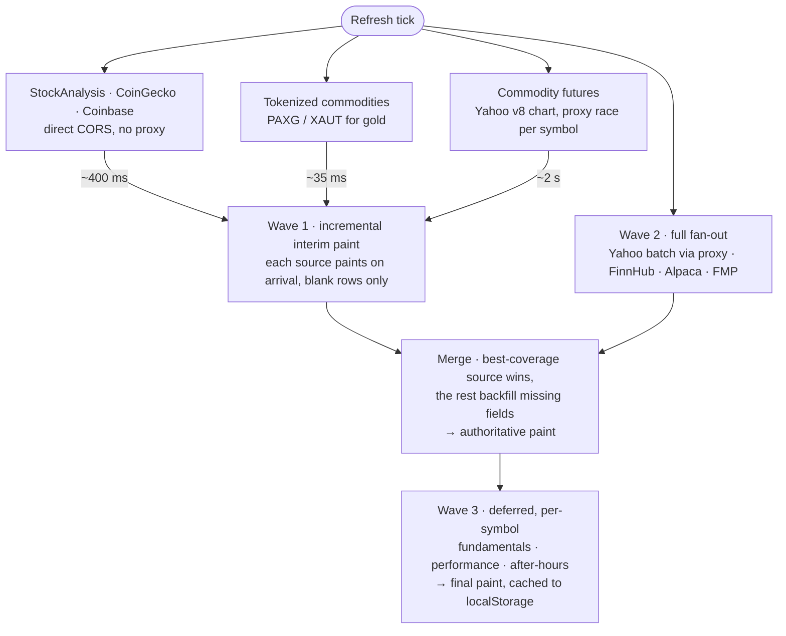

# Static Portfolio Tracker

**Live prices for stocks, crypto and commodities in a single static HTML file.** No server, no build step, no dependencies, no account. Open `index.html` and it works.

[**▶ Open the live app**](https://gdy.github.io/PortfolioTracker/)


---

## The problem

Most portfolio trackers want one of three things from you: brokerage credentials, a monthly subscription, or an account. The free ones are usually delayed, ad-supported, or quietly harvesting your holdings.

The constraint I set was: **a genuinely useful real-time tracker where your positions never leave your browser, using only free data.** That rules out a backend (nothing to send data *to*), which in turn rules out the usual answer to every hard problem below — no server-side caching, no API-key proxying, no rate-limit pooling across users. Everything has to work from a static file on GitHub Pages.

Most of what's interesting here is the consequences of that constraint.

---

## Highlights

| | |
|---|---|
| **10 data sources, automatic failover** | Picks whichever source covers the most symbols, then backfills individual missing fields from the others. Five are keyless *and* direct-CORS — including stocks — so the no-key path never depends on the proxy fleet for a price. |
| **Real-time streaming** | Trade-by-trade stock prices over WebSocket from Alpaca (IEX) and FinnHub, split so a portfolio with both keys streams up to 80 positions; Coinbase Exchange overlay so crypto ticks on a 2-second interval instead of waiting on CoinGecko's free API, which caches most data for 1–5 minutes. |
| **Delayed data is labelled** | Any price its source serves on a delay — futures, Alpaca's delayed-SIP fallback — carries a superscript **D** with the reason and the lag, and it clears only when a source positively confirms the price is live. A stale price is never shown as if it were live. |
| **Works with zero configuration** | No API key required. Keys unlock more columns and streaming, but the app is useful on first open. |
| **Everything stays local** | `localStorage` only. Positions, quantities and cost basis never leave the browser; the only thing sent out is the ticker symbols needed to fetch prices, to the data providers (and, for Yahoo, public CORS proxies). |
| **33 data columns** | Sortable, reorderable, hideable, with per-symbol notes, price alerts, and multi-portfolio support. |
| **Genuinely mobile** | The table becomes tap-to-expand cards with inline editing, drag-reorder, and pull-to-refresh — not a squeezed desktop layout. |

---

## Quick start

```
1. Download index.html  (or clone this repo)
2. Open it in any modern browser — desktop or mobile
3. Type a ticker, share count, and cost basis → + Add
```

That's it. No install, no `npm`, no server.

A **Welcome Guide** opens as a dialog on first launch, and **Load Sample Data** fills the table with a few well-known positions if you want to see it working before entering your own. Dismiss the guide with its close button, the backdrop, or `Esc`; re-open it any time from **Settings → Show Welcome Guide**.

**Optional free API keys** (Settings panel) unlock the rest: [Alpaca](https://app.alpaca.markets/signup) adds a real-time trade stream for your 30 largest stock positions, real bid/ask, real-time crypto, and a delayed-SIP fallback that covers names IEX alone misses; [FinnHub](https://finnhub.io/register) adds a second stream plus P/E, EPS, beta, dividends, earnings dates, and analyst ratings; an [FMP](https://site.financialmodelingprep.com/register) key adds a third quote fallback, but only keys issued before September 2025 (FMP retired the endpoint this app uses for newer free plans).

A key is optional. Without one you still get real-time stock and crypto prices, day P&L, and the 52-week range — what a key adds is the data no keyless source publishes: P/E, EPS, beta, dividends, earnings dates, analyst ratings, real bid/ask, and WebSocket streaming.

### Deploying your own

Push to GitHub → **Settings → Pages** → source `main`, folder `/` → visit `https://<user>.github.io/<repo>/`. It's a static file; there is nothing to configure.

---

## How it works

Every refresh runs as three waves, and **each wave-1 source paints the moment it lands** rather than waiting for its siblings — so every row appears at the speed of its own source, not the slowest one:



Two scheduling rules do most of the work here, and both were learned the hard way:

**Ask for the fast things first.** `fetch` fires when the promise is constructed, so construction order is request order. Constructing wave 2 first put the slow proxied calls on the wire ahead of the fast direct-CORS ones, which then competed with them for connections (browsers cap concurrent HTTP/1.1 connections per host at six) — sources that answer in 23–72 ms took 920 ms to reach the screen. Constructing wave 1 first brought that to 230 ms.

**Never put a fast source behind a barrier with a slow one.** A single `Promise.all` around wave 1 meant the interim paint ran at the speed of its slowest member; adding the commodity racer to it pushed stocks and crypto from 230 ms to 2.4 s even though their data had already arrived. Painting per source fixed it. The same mistake, in a worse form, is what made gold take **18.5 seconds**: its real-time token price was fetched in ~35 ms but awaited only after the entire Yahoo proxy chain had finished.

Four problems drove most of the design.

<details>
<summary><b>Resilience</b> — free APIs fail constantly, so no single source can be load-bearing</summary>

<br/>

Free financial APIs rate-limit, go down, silently return empty results, or drop coverage for individual tickers. The app treats every source as unreliable:

- **Ten sources run concurrently.** The one covering the most requested symbols becomes primary; the rest are merged in field-by-field to fill gaps (a source might have the price but not the 52-week range).
- **Yahoo Finance has no CORS headers**, so it goes through a public CORS proxy — and only for what the direct sources can't cover: a row StockAnalysis already priced and named makes no proxy call at all, and a name-only lookup that fails backs off for 2 minutes. In steady state the only proxied requests are commodity futures, which have no direct source. The pool code still races multiple proxies in parallel when there are several, but after the September 2026 audit only one free proxy works from a deployed site (see the graveyard).
- **Five sources are keyless *and* direct-CORS** — StockAnalysis for equities and ETFs, CoinGecko, Coinbase, Binance.US and Kraken for crypto. This is the structural change that matters most: a no-key portfolio of stocks and crypto now gets every price, day change, and 52-week range without touching a proxy at all. Yahoo is still keyless, but it is the only keyless source that needs the proxy fleet, and it is now used for what nothing else provides (fundamentals, historical performance, futures) rather than for prices.
- **Two venues for every asset class.** Equities have StockAnalysis and Yahoo; crypto has Coinbase (per-symbol) plus Binance.US and Kraken (batched); gold has PAXG on Coinbase with PAXG *and* XAUT on Kraken behind it. No single outage takes a whole asset class down.
- **Sources that can't succeed stop trying.** A source that cannot succeed is worse than a slow one, because every refresh pays its full timeout. A refusal that won't resolve itself latches that source off for the session: FinnHub's public demo token on its first 401, Binance.US and Kraken on a geo-block (403/451), and Alpaca's stream on bad keys or a connection already in use. A source that merely stops answering, like StockAnalysis, gets a 60-second circuit breaker instead, since from a browser a dead endpoint and a dropped connection look identical. (Sources that died outright were removed — see the graveyard.)
- **Circuit breakers.** Three consecutive all-symbol failures on the Coinbase overlay trigger a 30 s cooldown. Symbols Coinbase Exchange has no product for are excluded from that tally, so a listing gap can't be mistaken for an outage.
- **Jittered retries.** When *every* source fails — usually a proxy-fleet hiccup affecting many users at once — a single retry is scheduled ~8 s later with ±2 s of randomness, so recovering proxies don't get a synchronized thundering herd. Stream reconnects get ±20% jitter on their 5 s → 60 s backoff for the same reason.
- **Futures hedge their proxy requests.** Commodities are the only rows with no direct-CORS source, so they depend entirely on the one surviving proxy — whose latency is bimodal: successes land in 2–7 s, failures hang until they `522` at ~19 s. A short timeout cancels the slow-but-fine responses, and a long one stalls the refresh, so instead a second request goes to Yahoo's *other* CDN host if the first hasn't answered in 6 s, and the first one to arrive wins. A healthy proxy still costs exactly one request per symbol.
- **A missed commodity keeps trying in the background.** If every in-refresh attempt fails, the symbol retries on a detached timer (2 s, 7 s, 15 s) that paints the row the moment one lands, and stands aside whenever a refresh is running. Without it a futures row sat on “retrying…” until the next heavy refresh — up to 30 s on the default interval, which reads as broken on a first visit.
- **Background tabs back off.** A hidden tab polls at most once a minute, whatever the refresh setting, and catches up the moment it's visible again. Streams keep running, so streamed stocks and alerts on them stay live. The after-hours lookup also skips a symbol for 10 minutes after finding nothing, so a tab left open overnight isn't re-asking for pre/post prints that don't exist.

</details>

<details>
<summary><b>Freshness</b> — polling a 30-second cache every 2 seconds doesn't make it faster</summary>

<br/>

- **WebSocket streaming, split across two streams.** Positions are ranked by size and handed out: Alpaca's real-time IEX stream takes the **largest 30** (its free-plan cap), FinnHub's takes the **next 50**, and anything beyond polls over REST. Without Alpaca — no keys, streaming switched off, or refused — FinnHub goes back to the top 50. Both free streams deliver real-time trades; Alpaca gets the biggest positions for consistency, since its REST snapshots come from the same IEX feed, so a row's streamed and polled prices agree. Symbols that aren't plain US tickers (`SHOP.TO`, `BRK-B`) are never sent to Alpaca, so one foreign listing can't get a whole subscription rejected. Ranking is by market value at a **session-stable price** — the previous close, falling back to the open, then the current price, and only for a row with no quote yet, cost basis. Cost basis alone was the original rule and was wrong twice over: it is an optional field, so a portfolio that never filled it in streamed essentially at random, and a long-held winner bought at a tenth of today's price ranked at a tenth of its true weight — the position most worth streaming looked like the least. Live market value would be the obvious fix and is the wrong one: a price wobbling either side of the 30th-place cutoff would resubscribe both streams all day. A previous close doesn't move during the session, so the ranking is as steady as cost basis was while actually reflecting size.
- **A stream that goes quiet on one symbol hands it over.** Alpaca's free stream carries IEX only — a single venue with a few percent of consolidated volume — so a thinly-traded name can sit silent there while printing elsewhere. A symbol moves to FinnHub, whose free stream isn't tied to one exchange, when it has gone 3 minutes without an Alpaca trade **and** there is independent evidence it was trading anyway. Two things count as evidence: the symbol's own cumulative volume rising in the polled quote — which is measured per symbol and so works even when the portfolio holds a single stock — or, when no volume is available, other symbols on that same socket printing. The evidence requirement is the whole trick: it separates “this symbol is quiet” from “the market is quiet”. The volume signal matters because the socket-level one can't help a one-stock portfolio — there is no other symbol to compare against, which is exactly the case a user watching a single ticker is in. Auction prints are why this never leaves regular hours: the opening and closing crosses move millions of shares through a venue that isn't IEX, so a window spanning either one shows volume the stream could never have carried. The baseline reading therefore has to have been fetched during the session, not merely looked at during it — the review starts at 09:30 but the quote in hand can still be a pre-open one. A volume sample older than 15 minutes is likewise thrown away rather than compared against, because by then it isn't a window: the tab may have been backgrounded down to minute-long refreshes, or a session may have rolled over, and day volume restarts at zero each morning — so a page left open overnight would otherwise read a quiet open as a stream that had missed everything. Only during the regular session, only when FinnHub is connected with room to take it, and the list resets when Alpaca reconnects — so a borderline symbol can't ping-pong between streams all day.
- **The badge says which stream went quiet.** Staleness is tracked per stream rather than globally, so “Alpaca silent, FinnHub printing” reads as green with a tooltip naming Alpaca, instead of the old behaviour where one working stream masked the other entirely. The tooltip also reports any symbols that have been handed over.
- **Alpaca's stream is one connection per account**, so it's treated as a shared resource. On the free plan a second connection is refused (error 406) — including a trading bot on the same Alpaca account, or a second tab of this app. So it's a visible Settings switch that spells out that cost; a refusal stops the stream instead of retrying (retrying would keep snatching the slot back); and bad keys or a plan without the feed stop it too. Toggling the switch or saving keys tries again. If the server reports too many symbols (405), the cap steps down until it fits.
- **Crypto needed a different fix.** CoinGecko's keyless API caches most data for 1–5 minutes and allows only 5–15 calls a minute, so polling it faster returns identical data and invites rate limiting; the app calls it at most every 12 s. Coinbase Exchange's public ticker is real-time and direct-CORS, so it's layered on top: CoinGecko supplies slow-moving fields (24h high/low, market cap, volume), Coinbase patches price/bid/ask every tick. Past 10 coins the per-symbol fan-out switches to **one batched Binance.US call** (a dozen-plus requests per tick is far heavier than one), with **Kraken** filling anything Binance.US doesn't list and standing in wholesale if it fails. Both carry real bid/ask, so unlike the batch path they replaced there's no loss of spread data at scale.
- **Real-time gold via a tokenized proxy.** Free futures feeds are 10–15 min delayed at source, and real-time futures data genuinely requires a paid subscription. For gold specifically, the app fetches `PAXG-USD` from Coinbase in wave 1 (~35 ms) — PAX Gold is a redeemable claim on one troy ounce, trades 24/7, and tracks spot within ~1%. Its 24h open doubles as a previous close, so gold shows a real day change and range even on weekends when Yahoo isn't queried. **Kraken backs this up with both PAXG and XAUT** (Tether Gold — the same claim-on-an-ounce structure from a different issuer), so gold survives both a Coinbase outage and a problem specific to one token's peg. I checked the full product lists of all three CORS-reachable venues for metal-backed tokens: Coinbase, Kraken (1,450 pairs) and Binance.US carry PAXG and XAUT, and nothing else. It is a liquidity story — PAXG turns over ~$177M a day, while the nearest silver token (Kinesis KAG) does ~$84K and is listed on none of them. A token that thin can sit stale or print well off spot.
- **Real-time silver, platinum, palladium and copper — without a token.** Since no tradeable token exists for them, these come from a keyless spot-metals feed that sends `Access-Control-Allow-Origin: *`, so they are fetched **directly, never through the proxy**. Measured against a live reference, its gold print read 4333.30 while PAXG traded at 4333.35, and it restamps every 30 s. It is also the third gold fallback, behind Coinbase and Kraken.
  These are *spot* prices while the rows are dated futures contracts, so the previous close is converted onto the spot basis (using the ratio between the two prices observed at the same instant) before the day change is computed — silver spot 64.93 against "Silver Dec 26" at 65.15 is a 0.34% gap, which is $0.22 on a typical $1 daily move. If no futures quote exists to convert against, the row shows the live price and a dash for the change rather than an invented one. An anonymous free service with no SLA is strictly an overlay: any failure falls straight back to the delayed futures quote underneath, and three failures back it off for a minute.
- **Crude, Brent, natural gas and the ags have no real-time route at all.** No token, no spot feed. They stay on the delayed futures quote, marked **D**, and the tooltip names the ETF that tracks each one in real time (`USO`, `BNO`, `UNG`, `CORN`, `WEAT`, `SOYB`, `CANE`) — a pointer, not a substitution, because an ETF is a different instrument: USO trades near $162 while WTI is near $104, and the ratio drifts with every roll.
- **Tiered scheduling.** Active hours (4 AM–8 PM ET weekdays) poll everything. Off-hours poll only crypto and commodities. Weekends pause entirely unless you hold 24/7 assets.
- **Delayed prices say so.** Mixing sources means some rows are live and some aren't, and once a number is in the table there is nothing to distinguish them — the failure mode most likely to actually cost someone money. Every quote carries a tri-state provenance: a stated delay, a positive confirmation that it is real-time, or *unknown*. Anything delayed renders a superscript **D** with a tooltip naming the reason and the lag, and **unknown falls back to what the instrument implies** — so a futures row is marked from its very first paint rather than only once the refresh pass gets around to tagging it. The marker clears when a source positively asserts live: a streamed trade from Alpaca or FinnHub, or the PAXG overlay taking gold real-time. Gold is marked until that overlay actually lands, because off-hours and during a Coinbase cooldown it genuinely is on the delayed feed.

</details>

<details>
<summary><b>Scale</b> — a 50-position portfolio can't fan out 50× per tick</summary>

<br/>

- **Price fetching is batched where the API allows it** — one call each for CoinGecko, Alpaca, FMP (legacy keys), and the Binance.US/Kraken crypto overlay. Two sources fan out per symbol: Yahoo (its batch endpoint is gone) and StockAnalysis. StockAnalysis is cheap enough that this doesn't matter — measured at 60 symbols in ~455 ms, in batches of 10, because it is direct-CORS with no proxy hop. Yahoo's fan-out is the expensive one, which is why lazy enrichment below matters more than it used to.
- **The expensive part is per-symbol enrichment.** Yahoo has no batch endpoint for fundamentals or historical performance, so above ~25 positions the app enriches only the rows **currently on screen** and fetches the rest as they scroll into view. Off-screen rows still show live price, day P&L and the 52-week range — they're just missing P/E, EPS, beta and YTD/6M/1Y until visible.
- **Adaptive heavy-refresh cadence.** A full fan-out can't finish inside a 2 s tick on a large portfolio, so heavy refreshes are spaced at least ⌈stocks ÷ 15⌉ seconds apart (never below your chosen interval). Between them, lightweight crypto-only and commodity-only ticks keep 24/7 assets moving on your actual interval.
- **Rendering is tiered too.** At 60 positions × 34 columns a full table redraw costs ~10 ms and the targeted price-cell patch used by WebSocket and light ticks costs ~2 ms. Full redraws happen on a throttle, or immediately when the active sort depends on live prices and row order could change.

</details>

<details>
<summary><b>Trust</b> — third-party CORS proxies can see and modify every response</summary>

<br/>

Routing Yahoo through public proxies means an untrusted intermediary controls the response body. That shapes several decisions:

- **Response key guarding.** Quote payloads can only populate symbols the app actually requested. A compromised proxy returning a crafted symbol like `__proto__` is discarded before it can become an object key — otherwise it would pollute `Object.prototype` application-wide. The same guard applies to trade messages from both WebSocket streams via an explicit `hasOwnProperty` check.
- **API keys never touch a proxy.** FinnHub, Alpaca, and FMP are all direct-CORS, so keys go only to their own origins.
- **Numbers are checked, not trusted.** A proxied payload can put a string where a number belongs; values that reach markup without a formatter (analyst counts and scores) are checked for being finite numbers first.
- **Strict CSP.** A `Content-Security-Policy` meta tag blocks remote scripts, `eval`, and object/embed content, and limits `connect-src` to the exact hosts the app uses. `referrer` is `no-referrer`, so navigating away doesn't leak a shared-portfolio URL (which carries positions in its hash).
- **Untrusted input is escaped at the render site**, including CSV fields in the import preview and dates from shared URLs — a raw date flows into an HTML `value=""` attribute, so it's both validated on ingestion (`YYYY-MM-DD`) and escaped on render.

</details>

---

## Features

<details open>
<summary><b>Market data</b></summary>

<br/>

- **WebSocket streaming** — real-time stock prices via Alpaca (largest 30 positions) and FinnHub (next 50). Both streams feed one shared update path, so a row flashes, recalculates and fires alerts identically whichever stream its price came from; renders are debounced via `requestAnimationFrame`. Streams connect at page load rather than after the first full refresh. A green **● Live** badge shows when streaming, and its tooltip names each stream and how many stocks it carries. If trades stop arriving for 60+ seconds during the regular session, it flips to amber **● Live (no data)** with a tooltip explaining the likely cause. Pre- and post-market are exempt, since thin trading on IEX makes a quiet minute normal there. REST polling continues either way.
- **Stream status in Settings** — the Alpaca streaming switch shows what the stream is doing in words: streaming N stocks, connecting, reconnecting, or why it stopped.
- **Auto-reconnect with capped exponential backoff** — 5 s doubling to a 60 s ceiling for each stream, cleared only after a connection stays up 30 s. (FinnHub accepts the WebSocket handshake *before* validating the token, so an invalid key opens and immediately closes; resetting on open would pin the delay at 5 s forever.)
- **Auto-refresh** — 2 / 3 / 5 / 10 / 15 / 30 / 60 second intervals, with an overlap guard so a short interval on a slow network skips a tick instead of stacking requests.
- **Pre-market and after-hours pricing** — inline per row with change indicators, from StockAnalysis (which labels the session explicitly, so a pre-market print never appears under an "AH" heading) and Yahoo's v8 chart candles. Blanked during the regular session (keyed off live `marketState`, with an ET-clock fallback) so yesterday's post-market price never lingers into the next trading day.
- **Price flash animations** — green/red on change, using targeted in-place DOM patching so a field you're editing isn't destroyed mid-keystroke.
- **Instant paint on reload** — last-known quotes are cached and restored before the first network request, so reopening shows prices immediately instead of a wall of "loading…". Only prices and their delay provenance are cached — the provenance deliberately rides along, since restoring a delayed price without its marker would repaint it as if it were live. Deferred fields re-derive fresh each session so nothing else can go permanently stale.
- **Source attribution** — the status bar names the live sources, e.g. `Data via FinnHub + CoinGecko | WS streaming`.
- **Delayed-price marker** — a superscript **D** on any price its source served on a delay, with a tooltip giving the reason and the lag. Clears automatically when a real-time source supersedes it.

</details>

<details>
<summary><b>Portfolio management</b></summary>

<br/>

- **33 data columns** — symbol, name, price, change, % change, after-hours, quantity, cost basis, purchase date, market value, day P&L, total P&L, P&L %, dividend/yield, ex-div, earnings date, YTD/6M/1Y performance, prev close, open, bid, ask, day range, 52-week range, volume, avg volume, market cap, P/E, EPS, beta, analyst rating, and notes. Seven are locked as essential (symbol, name, price, change, % change, quantity, cost basis) and can't be hidden.
- **Analyst ratings** — Strong Buy → Strong Sell consensus from FinnHub with a Yahoo fallback, color-tinted by score. Click for a popover with the 1–5 score on a green-to-red scale and a stacked breakdown of analyst counts.
- **Multiple portfolios** — unlimited named portfolios with their own positions, notes, and undo history. Switching keeps loaded quotes in memory (keyed by symbol), so flipping between portfolios doesn't force a reload. The selector bar is hidden by default to save vertical space; enable it in Settings (auto-shown if you already have more than one).
- **Inline editing** — quantity, cost basis, date, and notes edit directly in the table or card.
- **Smart lot merging** — same-side lots average by share-weighted cost basis; an opposite-side lot is treated as a partial or full close, where the surviving side keeps its basis instead of blending a closing price into a meaningless average. Manual adds and CSV imports share one routine so they can't drift.
- **Short selling** — negative quantities track shorts with correct P&L (gains when price falls) and carry market value as a negative in the summary.
- **Undo / redo** — `Ctrl+Z` / `Ctrl+Y` (or `Ctrl+Shift+Z`) across every portfolio change, 50 levels deep, with toolbar buttons that enable and disable as the stacks change.
- **Price alerts** — per-symbol above/below thresholds with a 🔔 marker, row pulse, sound, and browser notification on cross. *Alerts are global, shared across all portfolios.*
- **Analytics panel** — three linked views that open together above the table:
  - *Allocation by position* — SVG donut with a 24-color palette tuned for dark backgrounds, live totals in the center, and hover/tap highlighting shared with its legend. Positions under 1.5% group into an "Other" slice on larger portfolios.
  - *Today's movers* — day P&L per position as bars diverging from a zero axis, picked by largest absolute move so gainers and losers both appear, then ordered best to worst.
  - *Exposure by asset class* — stocks / crypto / commodities as a stacked bar whose segments and legend rows cross-highlight each other, footed with best and worst performer by total P&L % and an advancing-vs-declining count for the day.

  All three are hover-linked and clickable: a legend or mover row jumps to that position in the table, and clicking an asset class flashes every position in it. They render from one data pass behind a shared signature gate, so they can't drift out of sync or re-render independently on a WebSocket tick, and on desktop they equalise to a single card height so the band reads as one row rather than three ragged stacks. Toggle with **Show Charts** in the summary bar.
- **Adaptive price precision** — decimals scale to magnitude (2 → 4 → 6 → 8), so SHIB shows `0.00002341` instead of `$0.00`. Dollar aggregates stay at 2.
- **Export CSV** — respects your current sort; re-imports cleanly into the app.
- **Export / import settings** — API keys, column layout, alerts, and preferences as a JSON file.
- **Share via URL** — portfolio encoded in the URL hash (up to 99 positions), gated behind a confirmation prompt on the recipient's side.
- **Estimated bid/ask** — when Alpaca isn't available, derived from last trade with a price-appropriate spread, marked `~` and dimmed.

</details>

<details>
<summary><b>CSV import</b></summary>

<br/>

Auto-detects exports from **Robinhood · E\*Trade · Fidelity · Charles Schwab · Webull · Vanguard**, and accepts a bare `Symbol, Shares, Cost, Date` with no headers.

- **Header auto-detection** maps Symbol, Shares/Quantity, Cost Basis (per-share *or* total, derived per share when only a total is present), Purchase Date, Last Price, and Type/Side. Candidate names are matched most-specific-first, so `Total Cost Basis` wins over a vaguer column regardless of column order.
- **Drag-and-drop or paste**, with a live preview and column-mapping diagnostics so you can see exactly which column became which field before committing.
- **Short and sale detection** from negative quantities, parenthesised `(5)`, or `Short` / `Sell` / `Sold` / `SLD` in a type, side or **Trans Code** column — the last is what Robinhood labels it, so a transaction history nets correctly instead of importing every sale as another purchase.
- **Transaction histories as well as positions exports.** When a row identifies itself as a trade and the file has no cost column, the traded price is taken as the cost basis; in a positions export the same column is today's market price and is deliberately never used that way.
- **Quote-aware parsing** handles quoted fields containing commas, escaped quotes, and embedded newlines.
- **Delimiter sniffing** for comma, semicolon and tab. European Excel writes `;` with the comma as the decimal mark (`1.330,10`), which a comma-split turned into plausible-looking nonsense rather than an error — so the separator is detected and the decimal convention follows it.
- **Share classes are normalised**: Schwab writes `BRK/B`, every source here wants `BRK.B`, and stripping the slash produced `BRKB`, which resolves nowhere.
- **Price seeding** — imported last prices display immediately, before any API responds.

</details>

<details>
<summary><b>Interface</b></summary>

<br/>

- **Sort any column** — change, P&L, and performance columns lead with the *best* value first, so one click on **% Chg** puts the day's biggest gainer on top; because those are live-price columns the ranking then re-sorts itself as prices move. Sort persists across sessions.
- **Right-click a column header** for sort ascending / descending / clear sort, hide column, or jump to the picker. Locked columns show as required rather than offering a hide that wouldn't work, and non-sortable columns omit the sort entries.
- **Right-click a Symbol or Name cell** for the same quick-actions menu a left-click opens — set alert, copy symbol, remove position — positioned at the pointer. Editable cells keep the browser's native menu so cut/paste and spellcheck still work.
- **Sticky header row** stays visible as you scroll down; the **symbol column is frozen** to the left edge as you scroll the wide table sideways.
- **Persistent horizontal scrollbar** pinned to the bottom of the viewport, so you can scroll the table sideways from anywhere on the page.
- **Mouse-wheel sideways scrolling** — when the page is short enough to have no vertical scrollbar, the wheel over the table scrolls it sideways instead of doing nothing. Hold `Alt` or `Shift` to scroll sideways even on a long page, with the same easing as the plain wheel — `Shift` is handled too because Chrome's native `Shift`+wheel animation crawls near the ends of the table. Firefox on Windows keeps its native `Alt`+wheel and `Shift`+wheel. It hands back to normal page scrolling once the table reaches its edge, leaves trackpad swipes to the browser, and eases between notches rather than jumping.
- **Drag-to-reorder** rows and columns; column layout and visibility persist per browser.
- **Zebra striping** with a strengthened divider, so a single row stays traceable across a wide table without adding row height.
- **Keyboard shortcuts** — `Tab` through toolbar inputs, `Enter` to add, `Ctrl+Z`/`Ctrl+Y` undo/redo, `?` for help, `Esc` to close overlays.
- **Dark terminal theme** with `color-scheme: dark` at the root, so native date pickers and scrollbars match.

</details>

<details>
<summary><b>Accessibility</b></summary>

<br/>

- **Colorblind-safe P&L** — gain/loss values carry a ▲ / ▼ glyph alongside the green/red tint in the desktop table cells, the summary bar, the movers panel, and mobile card detail rows, so direction survives without color perception. *(Not yet applied to the mobile card's headline price/change line or inline after-hours spans — see [Known gaps](#known-gaps).)*
- **Screen-reader hooks** — status bar, summary bar, and live indicator are `aria-live="polite"`; the table carries an `aria-label`; every icon-only toolbar button has an explicit `aria-label`.
- **Keyboard focus ring** — a high-contrast `:focus-visible` outline, visible for keyboard navigation and suppressed for mouse clicks.
- **Reduced motion** — flash animations, the donut sweep-in, and the "ready to add" pulse all fall back to static styling under `prefers-reduced-motion`.
- **The delayed-price marker is a glyph, not a colour.** The superscript **D** is readable without colour perception, and its tooltip states the reason and the lag in words. It is amber as a secondary cue only.

</details>

<details>
<summary><b>Mobile</b></summary>

<br/>

- **Card view** below 768px — the table becomes tap-to-expand cards showing symbol, name, price, change, shares, and cost at a glance, expanding to all 30+ fields with inline editing and delete.
- **Sortable** by any field via a dropdown with a direction toggle.
- **Drag-to-reorder** via the ☰ handle (auto-hidden while a sort is active), and **pull-to-refresh** on the card list.
- **No iOS zoom** — every input reachable on mobile is ≥16px, so Safari doesn't auto-zoom on focus.
- **Safe areas** for notched devices via `env(safe-area-inset-*)`, plus an extra breakpoint at 380px for iPhone SE.
- **Toolbar** collapses to a 2-column grid; **+ Add** becomes a full-width CTA that dismisses the keyboard on success rather than re-focusing the ticker field.

</details>

---

## Data sources

| Source | Key | Rate limit | Provides |
|---|---|---|---|
| **StockAnalysis** | — | direct CORS | **Keyless real-time US equities and ETFs, with no proxy hop.** Price, change, OHLC, volume, 52-week range, market state, and pre/post-market. Handles dotted tickers (`BRK.B`) and ETFs. 60 symbols in ~455 ms. |
| **Yahoo Finance** | — | via CORS proxies | Quotes (v8 chart), fundamentals, after-hours, historical performance, and commodity futures |
| **FinnHub** | free | 60/min + WebSocket | WebSocket streaming (stocks), quotes, profiles, P/E, EPS, beta, dividends, earnings, analyst ratings |
| **Alpaca Markets** | free | 200/min + 1 stream (30 symbols) | Real-time IEX trade stream, IEX snapshots, delayed-SIP fallback for names IEX doesn't cover, real bid/ask, avg volume, historical bars |
| **Alpaca Crypto** | free | 200/min | Real-time crypto snapshots — no feed tiers and no delay on the free plan, unlike equities |
| **Financial Modeling Prep** | legacy keys only | 250/day | Quotes with after-hours, fundamentals. Uses `/api/v3`, which FMP restricted to subscriptions from before 31 Aug 2025; newer free keys get an error here and the other sources cover the gap. |
| **CoinGecko** | — | 5–15/min keyless | Crypto 24h high/low, market cap, volume, 1-year chart for 52-week range and performance |
| **Coinbase Exchange** | — | 10/s | Real-time crypto price/bid/ask overlay; PAXG for real-time gold |
| **Binance.US** | — | direct CORS | Batched real-time crypto overlay above 10 coins, with real bid/ask. 36 of the 37 supported coins. |
| **Kraken** | — | direct CORS | Batched crypto backstop — the only venue covering all 37 coins — plus PAXG *and* XAUT as gold failover when Coinbase is unavailable. |
| **gold-api.com** | — | direct CORS, none stated | Real-time spot metals: silver, platinum, palladium, copper (symbol `HG`, not `XCU`) and gold. The only real-time source for the four non-gold metals, and the one that takes them off the proxy entirely. Overlay only — failures fall back to the delayed futures quote. |

> **Verified 2026-09-01** against the live endpoints. Free financial APIs change access terms without notice: two sources moved behind keys since the previous audit and were replaced (see the graveyard below). Treat the dates as when each row was last checked, not when the code was written.

<details>
<summary>Implementation notes — caching, cooldowns, and call budgets</summary>

<br/>

- **Yahoo v7 batch and the crumb are permanently closed, not temporarily broken.** The batch endpoint returns `401 Unauthorized` for everyone, and `/v1/test/getcrumb` returns `401 Invalid Cookie` on both CDN hosts through any proxy. The crumb requires a Yahoo consent cookie issued by `fc.yahoo.com`, and a stateless passthrough proxy makes each request independently — it cannot carry that cookie, and the browser cannot hold a cross-origin cookie for Yahoo. **Fixing this requires a stateful backend, which is the one thing this project rules out.** Both paths are still attempted because they cost one request and cache their failure, but the working path is the per-symbol **v8 chart** endpoint.
- **Keyless `quoteSummary`** is capped at two failures per symbol per session — Yahoo gates it hard without consent cookies, so endless retries only burn shared proxy budget.
- **FinnHub fundamentals** — profile, metrics, earnings, and recommendations fetched once per symbol per session and cached; per-refresh calls hit only the lightweight `/quote`. Dividend data comes from `/stock/metric`, not the dedicated `/stock/dividend` endpoint, which is premium-only and returns 403 on every free key.
- **CoinGecko TTL** scales with portfolio size — a 3 s floor for ≤5 coins, 30 s for larger — minus a 1 s alignment buffer so the cache expires *before* the next tick rather than skipping every other fetch.
- **Fast new-ticker fetch** — adding a position races StockAnalysis, FinnHub, Alpaca, a Coinbase PAXG lookup for gold, and proxied Yahoo in parallel, applying whichever returns a valid price first. StockAnalysis usually wins outright at ~30 ms warm, since everything else either needs a key or a proxy hop. A background warmer then fires the four FinnHub fundamentals endpoints without the inter-batch delays, so P/E and analyst rating land in ~1 s rather than at the next refresh.
- **Abort propagation** — switching portfolios or clearing positions aborts the in-flight refresh, and the signal is threaded through the proxy layer and per-symbol enrichment so superseded calls are genuinely cancelled, releasing the shared proxy pool immediately.

</details>

---

## Data graveyard

Free financial APIs die, and they rarely announce it. Every source below was either used by the app and then lost, or turned out to be unusable when it was needed. Kept as a record so the same ground doesn't get re-tested every time something breaks, and because the failure modes turned out to be more instructive than the successes.

| Source | Died | What happened | Replaced by |
|---|---|---|---|
| **Stooq** | ~Mar 2026 | Introduced a mandatory API key. The keyless CSV endpoint now returns 404 for everyone and the site serves a JavaScript proof-of-work interstitial to non-browser clients. Direct CORS stopped being allowed at the same time. ([independently reported](https://github.com/pydata/pandas-datareader/issues/1012)) | **StockAnalysis** |
| **CryptoCompare** | ~2026 | Moved under CoinDesk and retired anonymous access — `min-api.cryptocompare.com` now answers `401 {"message":"API key required"}`. | **Binance.US** + **Kraken** |
| **Yahoo `/v7/finance/quote`** | 2025–26 | Returns `401 Unauthorized · User is unable to access this feature`. The batch quote endpoint is simply gone for unauthenticated callers. | Yahoo **v8 chart**, per symbol |
| **Yahoo `/v6/finance/quote`** | earlier | `404` — endpoint removed. | as above |
| **Yahoo crumb / `quoteSummary`** | 2023–26 | `401 Invalid Cookie`. Needs a consent cookie from `fc.yahoo.com`; a stateless CORS proxy can't carry one and the browser can't hold a cross-origin Yahoo cookie. **Unfixable without a backend** — see Known gaps. | FinnHub / Alpaca (key required) |
| **CoinCap** | 2025 | `api.coincap.io` decommissioned; the v3 host at `rest.coincap.io` returns `401` without a key. | Coinbase, Binance.US, Kraken |
| **IEX Cloud** | Aug 2024 | Shut down entirely before it could be used here. | — |
| **FMP `/api/v3`** (newer free keys) | 31 Aug 2025 | Restricted to accounts with subscriptions from before that date; newer free plans only get FMP's "stable" API, whose quote endpoint takes one symbol per call — unworkable for live quotes on 250 calls a day. The integration stays for older keys. | Alpaca, FinnHub, StockAnalysis |
| **FinnHub `/stock/dividend`** | — | Not dead, but **premium-only**: returns `403` on every free key. It was 1 of 5 calls fired per symbol, so a fifth of the fundamentals budget bought a guaranteed error. | `/stock/metric`, which carries the same fields on the free tier |
| **`thingproxy.freeboard.io`** | ~2026 | NXDOMAIN — the domain no longer exists. | — |
| **`crossorigin.me`** | years ago | Service shut down and the domain changed hands. Requests carried portfolio symbols in the URL to an unknown party for zero chance of a response. | — |
| **`api.codetabs.com`** | ~Aug 2026 | Stopped answering. Notably it does not *refuse* — it **hangs**, burning the full 10 s timeout and holding a connection slot on every rotation. | — |
| **`corsproxy.io`** (keyless form) | ~2026 | Hard `403 keyless_legacy_url` — the anonymous URL form was retired in favour of account API keys, which a public static file can't ship. | — |
| **`proxy.cors.sh`** | ~Sep 2026 | The hostname stopped resolving (NXDOMAIN). A lapsed proxy domain is a liability, not just dead weight: whoever registers it next would receive every user's ticker symbols and control the JSON the app parses. | — |
| **`proxy.corsfix.com`** | never worked in production | Free use is **localhost-only**. Every other origin, including the GitHub Pages site, gets `403 domain_not_registered`. It measured as the fastest proxy in local testing, which is exactly why it looked healthy. | — |

Two things this table taught the design:

**Test from the real origin, not localhost.** Corsfix passed every local test and never once worked on the deployed site. Proxies and some APIs grant `localhost` privileges they deny a production domain.

**A source that hangs is far worse than one that errors.** A fast `403` costs ~30 ms; a hang costs a full timeout *and* a connection slot, and if it sits in a blocking wave it stalls the entire first paint. Stooq and codetabs were both in that category, and between them they were the reason a keyless first load could sit blank for ~30 seconds. Everything that can fail now either fails fast or backs itself off. Which of the two matters: a source that refuses with an explicit status (`401`/`403`/`451`) is latched off for the session, because that will not resolve itself. A source that merely stops answering gets a 60-second circuit breaker instead — from a browser, "this endpoint is gone" and "the user's wifi dropped" are the same observable event, so a permanent latch there would disable a healthy source for the rest of the session over a passing blip.

**Don't fix a dead source if the replacement is better anyway.** Stooq and CryptoCompare could both be revived with keys. Neither was worth it: Stooq's replacement is real-time instead of 15 minutes delayed and handles the dotted tickers Stooq skipped, and CryptoCompare's replacements are batched *and* carry real bid/ask, which it never did. Adding a key field to Settings would have been the smaller change and the worse outcome.

### Checked and rejected

Tested for keyless + direct-CORS access and found unusable, so nobody has to re-test them: **Binance.com, OKX, Bybit, KuCoin, Bitstamp, Bitfinex, Crypto.com** (no CORS headers from a browser); **CNBC, Nasdaq, WSJ** (no CORS); **Polygon, marketstack, Twelve Data, Alpha Vantage** (key required, and Alpha Vantage's free tier is 25 requests/day). **TradingView's scanner** does work batched with CORS, but needs exchange-prefixed tickers (`NASDAQ:AAPL`) that the app has no way to resolve.

Also searched: a tokenized stand-in for **silver, platinum or copper**, the way PAXG works for gold. Coinbase, Kraken (1,450 pairs) and Binance.US between them list exactly two metal-backed tokens, PAXG and XAUT, both gold. Kinesis Silver (KAG) and Kinesis Gold (KAU) exist but turn over ~$84K and ~$65K a day against PAXG's ~$177M, and are on none of those venues; at that depth a token can sit stale or drift off spot, which is worse than an honestly-labelled delayed price. **Oil-backed tokens** (WTIC, XTI and similar) are newly minted, tiny, absent from every venue the app can reach, and discussed in the trade press alongside the question of whether they are scams — not something to put behind a portfolio row.

A caution from that search: MEXC lists a `KAGUSDT` at about **$36** while Kinesis Silver trades near **$65**. Same ticker, different asset. Ticker collisions are exactly how a tracker ends up confidently displaying a wrong number, which is why every source is read through the app's own symbol map rather than by trusting a ticker string.

What the search did turn up is better than a token: a **keyless spot-metals API with open CORS**, which is how silver, platinum, palladium and copper became real-time. It carries no energy or agricultural symbols, so those remain delayed.

---

## Data storage

Everything lives in `localStorage`. Positions, quantities and cost basis are never transmitted; the only outbound data is ticker symbols, sent to the data providers above and, for Yahoo, through public CORS proxies. Writes are debounced on a trailing 250 ms timer and flushed on `beforeunload`, `pagehide`, and `visibilitychange` — the last two matter because iOS routinely skips `beforeunload` when you switch apps.

Every key keeps the `stonks_` prefix from the project's original name. Renaming them would silently orphan every existing user's portfolio, so the prefix stays — it is a storage format, not a brand.

| Key | Contents |
|---|---|
| `stonks_portfolios` | All named portfolios: `{ name: { portfolio, notes } }` |
| `stonks_active_portfolio` | Currently selected portfolio |
| `stonks_portfolio` · `stonks_notes` | Active portfolio's positions and notes (mirrored for backward compatibility) |
| `stonks_quotes` | Last-known quotes for instant paint on reload; pruned to current holdings |
| `stonks_alerts` | Price alert thresholds, `{ symbol: { above, below } }` — global across portfolios |
| `stonks_hidden_columns` · `stonks_column_order` | Column visibility and order |
| `stonks_sort` | Active sort column and direction |
| `stonks_alloc_visible` | Allocation chart show/hide |
| `stonks_show_portfolio_bar` | Portfolio selector bar visibility |
| `stonks_finnhub_key` · `stonks_alpaca_key_id` · `stonks_alpaca_secret` · `stonks_fmp_key` | API keys |
| `stonks_alpaca_stream` | Alpaca real-time streaming switch (`0` = off; on by default) |
| `stonks_refresh_interval` · `stonks_auto_refresh` | Refresh preferences |
| `stonks_welcome_dismissed` | Welcome guide state |
| `stonks_debug` | Verbose logging flag (see below) |

Corrupt entries are detected on load: the bad key is removed and the app boots with an empty fallback rather than crashing. Clearing browser data resets everything.

---

## Known gaps

Being honest about what isn't done, and why:

- **Two sources were lost to key-gating and have been replaced.** Stooq and CryptoCompare both moved behind API keys; their replacements are better on every axis that matters, so no key support was added for either. Details in the graveyard above.
- **FMP keys only work if they predate September 2025.** FMP restricted the endpoint this app calls to older accounts. Newer free keys get an error and the other sources cover the gap, but it's no longer a key worth signing up for.
- **Market holidays aren't recognised.** Scheduling and the streaming "Live (no data)" check use the regular weekday session, so on a market holiday the badge can turn amber and polling runs as if the market were open.
- **Energy and agricultural commodities are 10–15 minutes delayed.** Real-time futures data requires a paid market-data subscription. Gold goes real-time through PAXG/XAUT, and silver, platinum, palladium and copper through a keyless spot-metals feed — but crude, Brent, natural gas, corn, wheat, soybeans, sugar, coffee and cotton have neither a liquid token nor a spot feed, so they stay delayed and marked **D**. The tooltip names a real-time ETF tracking each where one exists.
- **Yahoo depends on public CORS proxies**, which are the least reliable link in the chain. This used to take stock prices down with it for no-key users; StockAnalysis now covers keyless equity prices without a proxy, so a proxy-fleet outage degrades **fundamentals, historical performance, and commodity futures** rather than the price column. Those three have no keyless direct-CORS source — adding a free FinnHub or Alpaca key is still the single biggest reliability upgrade available.
- **The proxy pool is down to one.** Public CORS proxies quietly die, and most surviving free ones are localhost-only or need an account key a public file can't ship. The September 2026 audit, run from the production origin, found that only `api.allorigins.win` still works, and even that is intermittent (seconds to minutes of `522`s). This is also shared infrastructure: every visitor's Yahoo requests go through the same community service, which is why proxied calls are now limited to what nothing else can supply. If Yahoo-backed fields go blank, check the pool from a real deployed origin before anything else.
- **StockAnalysis and Yahoo are both unofficial endpoints.** Neither publishes a public API contract, so either can change shape or disappear without notice. That's the standing cost of the no-backend, no-key constraint, and it's why nothing in the app is allowed to be load-bearing on one source: every field either has a second provider or degrades to a dash. It's also why the app tries to be a light client: every visitor's browser calls these services directly from the same site, so a traffic spike looks like one busy origin, which makes it easy to rate-limit or block. That's the reason for the batching, the background-tab back-off, and skipping the proxy for rows that are already covered.
- **Company names lag the first paint by a few seconds.** StockAnalysis's quote payload carries no company name, and it is now the first source to return, so a row can briefly read `MSFT / MSFT` before Yahoo or FinnHub merges the real name in. It self-corrects within a few seconds once a name is learned (names are cached, so this only happens on the first load of a symbol); if the proxy is down and no key is set, the ticker is all you get, with a retry every 2 minutes. The alternative was shipping a hardcoded ticker-to-name table, which would be stale the week after it was written.
- **Safari deletes the data after 7 days away.** WebKit's tracking prevention clears all script-writable storage — localStorage included — after seven days of Safari use without a visit to the site, and it has worked that way since Safari 13.1. Everything here lives in localStorage, so an iPhone or Mac user who doesn't open the tracker for a week can come back to an empty portfolio. Three ways around it: open it at least weekly, keep a copy via **Export Settings** or a share link, or **Add to Home Screen** — home-screen web apps sit outside Safari and keep their own storage. Chrome and Firefox do not do this.
- **Price alerts are global, not per-portfolio.** They're keyed by symbol alone, so the same threshold applies everywhere.
- **Colorblind ▲/▼ glyphs don't reach the mobile card's headline price/change line** — only the detail rows, table cells, and summary bar.
- **No automated test suite.** Verification is manual against a local static server. For a single file with no build step this has been a reasonable trade so far; it would not scale to a second contributor.

---

## Compatibility & debugging

**Browsers** — Chrome/Edge 103+, Firefox 100+, Safari 16+ (mid-2022 and newer). The binding constraint is `AbortSignal.timeout`, used on every network call to prevent a hung fetch from freezing the refresh loop. `structuredClone` (Safari 15.4+) and `Promise.any` are also required. `AbortSignal.any` is feature-detected and degrades gracefully on older browsers. No IE support.

**Debugging** — per-symbol and per-proxy fetch warnings are silenced by default, since one refresh races several proxies × symbols and most non-winners produce expected errors. To turn the verbose stream back on:

```js
localStorage.setItem('stonks_debug', '1');
location.reload();
```

Source-level events — auth failures, rate limits, WebSocket connect/close, quota errors, and top-level refresh exceptions — always log regardless.

---

## Security

<details>
<summary>Threat model and mitigations</summary>

<br/>

The interesting property of this app is that it has no backend, so the attack surface is entirely client-side plus the untrusted CORS proxies in front of Yahoo. The main asset worth protecting is the API keys in `localStorage`: any script running on the origin can read them, so almost every mitigation below is about keeping attacker-controlled data from becoming script.

**Content Security Policy** — a meta-tag CSP sets `default-src 'self'`, blocks remote scripts, `eval`, and `object`/`embed` content, restricts `connect-src` to the exact hosts the app talks to (so injected script couldn't `fetch()` keys to an arbitrary server — though it could still navigate the page away with them), and sets `frame-src 'none'` so the app cannot load third-party frames. Note that this does *not* prevent the app from being framed by someone else — that requires a `frame-ancestors` directive, which browsers ignore in a meta tag and which would need an HTTP response header. `referrer` is `no-referrer`, so a shared-portfolio URL (positions in the hash) isn't leaked on navigation.

**Untrusted API and proxy responses** — quote payloads can only populate symbols the app requested, so a crafted key such as `__proto__` from a compromised proxy is discarded before it can pollute `Object.prototype`. WebSocket trade messages use an explicit `hasOwnProperty` check for the same reason. API keys go only to their own origins, never through a proxy.

Response *values* are treated the same way. Most numeric fields go through formatters built on `Intl.NumberFormat`, which can only emit digits. The exceptions were analyst counts and scores, concatenated directly: Yahoo's `quoteSummary` reader passed `raw` values through without a type check, so a proxy returning `numberOfAnalystOpinions: {raw: ""}` reached `innerHTML`. That reader now accepts only finite numbers, and the render sites check again. The two free-text fields a payload controls verbatim — the ex-dividend and next-earnings dates, which Yahoo supplies as pre-formatted strings — are escaped and length-capped at the render site. They were previously interpolated raw into the table, which a compromised proxy could have turned into script execution; the CSP does not help there, since `script-src` has to allow `'unsafe-inline'` for the app's own handlers.

**Untrusted user input** — imported CSV fields are escaped in the preview, and the preview caps how many rows it draws so a mis-dropped transaction log can't freeze the tab. The column picker attaches handlers via `addEventListener` and reads keys from `data-` attributes rather than interpolating them into inline `onclick`. External links use `rel="noopener noreferrer"`.

**Symbols** are whitelisted to `[A-Z0-9.\-=]` on *every* path that can introduce one — manual entry, CSV import, shared URL, and state restored from `localStorage`. That last one matters because symbols are interpolated into inline `onclick` handlers, where attribute escaping alone is not enough: the HTML parser decodes `&#39;` back to a real apostrophe before the JS is parsed, so a stored quote could otherwise terminate the argument. Writing `localStorage` already requires script execution on this origin, so this is defence in depth rather than a privilege boundary — the point is that the invariant holds everywhere instead of by convention.

**Settings files** are treated as untrusted, because "import my layout" is an easy thing to trick someone into. Price-alert thresholds were stored exactly as imported, and the mobile cards write them into `value=""` attributes, so a crafted file could run script and read the stored keys. That was verified with a working payload before the fix. Alerts are now rebuilt on import and on load: symbol keys must match the whitelist, and only finite numbers survive. Key fields must be strings, and the refresh and toggle settings must match their allowed values. The export button warns that the file contains your keys.

**Column layout** loaded from a settings file is resolved through a `Map`, not a plain-object lookup. With an object, an entry of `__proto__` or `constructor` satisfies a truthiness check and injects `Object.prototype` into the column list, rendering phantom headers.

**Portfolio names** index a plain object, so the same class of name misbehaves there too — and `__proto__` is the sharp one: `all['__proto__'] = {…}` doesn't create a property, it reassigns the prototype, so the portfolio is silently never stored while the UI switches to it. A short reserved-word list is rejected up front, and existence checks use `hasOwnProperty` rather than truthiness so an inherited key can't pass as a saved portfolio.

**Every source is read through the app's own symbol map, never by iterating the response.** This is what keeps the response-key guard holding as the source count grows: Binance.US and Kraken responses are indexed by their pair, then looked up via our map; Kraken's internal keys (`XXBTZUSD`) never touch `quoteData` directly. None of the sources added recently contribute a free-text field to the DOM — their names come from our own tables and their numeric fields go through `Number()` — so the untrusted-string render surface did not grow with them.

**Shared-URL imports** — parsed with a symbol whitelist (`[A-Z0-9.\-=]`), a 10-character cap, numeric coercion, and strict `YYYY-MM-DD` date validation, then gated behind a confirmation dialog. The date matters specifically because it flows into an HTML `value=""` attribute; it's validated on ingestion *and* escaped at every render site.

</details>

---

## Author

Built by [Grant](https://github.com/gdy) · [MIT licensed](LICENSE)
