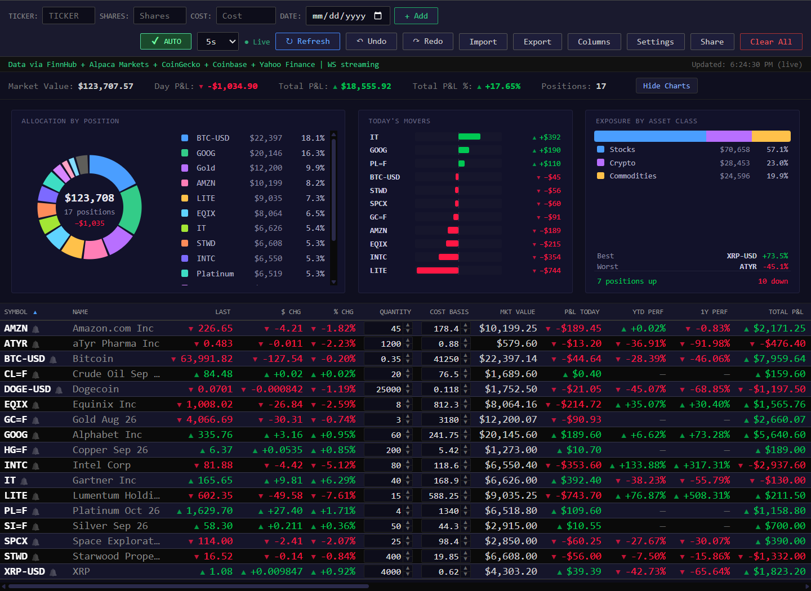
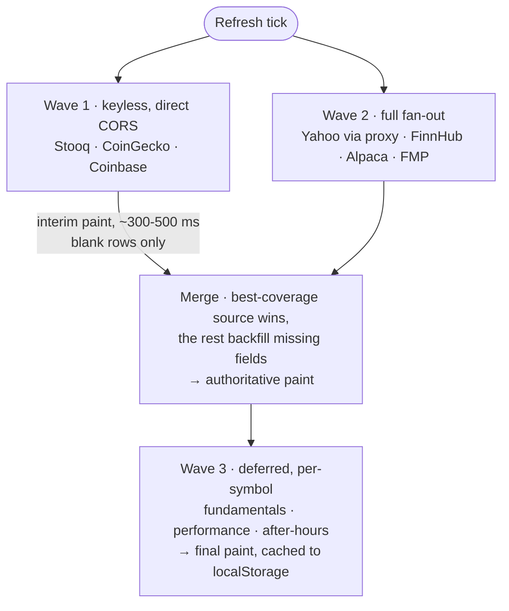

# STONKS — Portfolio Tracker

**A real-time portfolio tracker for stocks, crypto, and commodities that runs entirely in one HTML file.** No server, no build step, no dependencies, no account. Open `index.html` and it works.

[**▶ Open the live app**](https://gdy.github.io/PortfolioTracker/)


<!-- SCREENSHOT — save the images, then delete this comment and uncomment the two blocks below.
     docs/screenshot.png       cropped hero: Symbol → P&L %, all rows (~2:1 renders legibly at GitHub's ~850px width)
     docs/screenshot-wide.png  the full 33-column capture, at native resolution



<details>
<summary>See the full column set</summary>

<br/>

[](docs/screenshot-wide.png)

</details>
-->

---

## The problem

Most portfolio trackers want one of three things from you: brokerage credentials, a monthly subscription, or an account. The free ones are usually delayed, ad-supported, or quietly harvesting your holdings.

The constraint I set was: **a genuinely useful real-time tracker where your positions never leave your browser, using only free data.** That rules out a backend (nothing to send data *to*), which in turn rules out the usual answer to every hard problem below — no server-side caching, no API-key proxying, no rate-limit pooling across users. Everything has to work from a static file on GitHub Pages.

Most of what's interesting here is the consequences of that constraint.

---

## Highlights

| | |
|---|---|
| **8 data sources, automatic failover** | Picks whichever source covers the most symbols, then backfills individual missing fields from the others. Four are keyless *and* direct-CORS, so the no-API-key path stays alive when the proxy fleet is degraded. |
| **Real-time streaming** | FinnHub WebSocket for trade-by-trade stock prices; Coinbase Exchange overlay so crypto ticks on a 2-second interval instead of CoinGecko's 30–60 s server-side cycle. |
| **Works with zero configuration** | No API key required. Keys unlock more columns and streaming, but the app is useful on first open. |
| **Everything stays local** | `localStorage` only. Data goes to financial APIs and nowhere else. |
| **33 data columns** | Sortable, reorderable, hideable, with per-symbol notes, price alerts, and multi-portfolio support. |
| **Genuinely mobile** | The table becomes tap-to-expand cards with inline editing, drag-reorder, and pull-to-refresh — not a squeezed desktop layout. |

---

## Quick start

```
1. Download index.html  (or clone this repo)
2. Open it in any modern browser — desktop or mobile
3. Type a ticker, share count, and cost basis → + Add
```

That's it. No install, no `npm`, no server.

A **Welcome Guide** walks through setup on first launch, and **Load Sample Data** fills the table with a few well-known positions if you want to see it working before entering your own. Re-open the guide any time from **Settings → Show Welcome Guide**.

**Optional free API keys** (Settings panel) unlock the rest: [FinnHub](https://finnhub.io/register) adds WebSocket streaming plus P/E, EPS, beta, dividends, earnings dates, and analyst ratings; [Alpaca](https://app.alpaca.markets/signup) adds real bid/ask; [FMP](https://site.financialmodelingprep.com/register) adds a third quote fallback.

### Deploying your own

Push to GitHub → **Settings → Pages** → source `main`, folder `/` → visit `https://<user>.github.io/<repo>/`. It's a static file; there is nothing to configure.

---

## How it works

Every refresh runs as three waves, so the table paints as soon as *anything* useful arrives rather than blocking on the slowest source:



Four problems drove most of the design.

<details>
<summary><b>Resilience</b> — free APIs fail constantly, so no single source can be load-bearing</summary>

<br/>

Free financial APIs rate-limit, go down, silently return empty results, or drop coverage for individual tickers. The app treats every source as unreliable:

- **Eight sources run concurrently.** The one covering the most requested symbols becomes primary; the rest are merged in field-by-field to fill gaps (a source might have the price but not the 52-week range).
- **Yahoo Finance has no CORS headers**, so it goes through a rotating pool of 4 public CORS proxies with last-working-proxy memory. If the sticky proxy fails, the remaining proxies are **raced in parallel** rather than walked sequentially — bounding worst-case latency at roughly two timeouts instead of four.
- **Four sources are keyless *and* direct-CORS** (Stooq, CoinGecko, Coinbase, CryptoCompare). Yahoo is also keyless but depends on the proxy fleet, so these four give the no-key path a fallback chain that doesn't share Yahoo's fragility.
- **Circuit breakers.** Three consecutive all-symbol failures on the Coinbase overlay trigger a 30 s cooldown, automatically falling back to CryptoCompare. FinnHub's public demo token is dead upstream, so its first 401 latches that path off for the session rather than paying a doomed round-trip every refresh.
- **Jittered retries.** When *every* source fails — usually a proxy-fleet hiccup affecting many users at once — a single retry is scheduled ~8 s later with ±2 s of randomness, so recovering proxies don't get a synchronized thundering herd.

</details>

<details>
<summary><b>Freshness</b> — polling a 30-second cache every 2 seconds doesn't make it faster</summary>

<br/>

- **WebSocket streaming.** FinnHub's WebSocket gives trade-by-trade stock prices with no proxy involved. Free tier caps at 50 symbols, so past that the app streams the **largest positions by cost basis** and lets the rest fall back to REST polling. Ranking by cost basis rather than live market value is deliberate: market value wobbles across the 50/51 boundary and would thrash subscriptions all day.
- **Crypto needed a different fix.** CoinGecko's free endpoint updates server-side only every 30–60 s, so a 2 s poll returns identical data. Coinbase Exchange's public ticker is real-time and direct-CORS, so it's layered on top: CoinGecko supplies slow-moving fields (24h high/low, market cap, volume), Coinbase patches price/bid/ask every tick. Past 10 coins the per-symbol fan-out switches to one batched CryptoCompare call, since browsers cap ~6 connections per origin and a large fan-out would just serialize.
- **Real-time gold via a tokenized proxy.** Free futures feeds are 10–15 min delayed at source, and real-time futures data genuinely requires a paid subscription. For gold specifically, the app fetches `PAXG-USD` from Coinbase — PAX Gold is a redeemable claim on one troy ounce, trades 24/7, and tracks spot within ~1%. Its 24h open doubles as a previous close, so gold shows a real day change and range even on weekends when Yahoo isn't queried. No other commodity has an equivalent token with a clean peg and a Coinbase listing, so the rest stay on the delayed feed.
- **Tiered scheduling.** Active hours (4 AM–8 PM ET weekdays) poll everything. Off-hours poll only crypto and commodities. Weekends pause entirely unless you hold 24/7 assets.

</details>

<details>
<summary><b>Scale</b> — a 50-position portfolio can't fan out 50× per tick</summary>

<br/>

- **Price fetching is batched** — one call each for Yahoo v7, Stooq, CoinGecko, Alpaca, and FMP — so prices and day P&L scale regardless of portfolio size.
- **The expensive part is per-symbol enrichment.** Yahoo has no batch endpoint for fundamentals or historical performance, so above ~25 positions the app enriches only the rows **currently on screen** and fetches the rest as they scroll into view. Off-screen rows still show live price and day P&L from the batch — they're just missing P/E, 52-week range, and YTD/6M/1Y until visible.
- **Adaptive heavy-refresh cadence.** A full fan-out can't finish inside a 2 s tick on a large portfolio, so heavy refreshes are spaced at least ⌈stocks ÷ 15⌉ seconds apart (never below your chosen interval). Between them, lightweight crypto-only and commodity-only ticks keep 24/7 assets moving on your actual interval.
- **Rendering is tiered too.** A full table redraw costs ~15–20 ms; the targeted price-cell patch used by WebSocket and light ticks costs well under 1 ms. Full redraws happen on a throttle, or immediately when the active sort depends on live prices and row order could change.

</details>

<details>
<summary><b>Trust</b> — third-party CORS proxies can see and modify every response</summary>

<br/>

Routing Yahoo through public proxies means an untrusted intermediary controls the response body. That shapes several decisions:

- **Response key guarding.** Quote payloads can only populate symbols the app actually requested. A compromised proxy returning a crafted symbol like `__proto__` is discarded before it can become an object key — otherwise it would pollute `Object.prototype` application-wide. The same guard applies to WebSocket trade messages via an explicit `hasOwnProperty` check.
- **API keys never touch a proxy.** FinnHub, Alpaca, and FMP are all direct-CORS, so keys go only to their own origins.
- **Strict CSP.** A `Content-Security-Policy` meta tag blocks remote scripts, `eval`, and object/embed content, and limits `connect-src` to `https:`/`wss:`. `referrer` is `no-referrer`, so navigating away doesn't leak a shared-portfolio URL (which carries positions in its hash).
- **Untrusted input is escaped at the render site**, including CSV fields in the import preview and dates from shared URLs — a raw date flows into an HTML `value=""` attribute, so it's both validated on ingestion (`YYYY-MM-DD`) and escaped on render.

</details>

---

## Features

<details open>
<summary><b>Market data</b></summary>

<br/>

- **WebSocket streaming** — real-time stock prices via FinnHub (up to 50 symbols; largest positions prioritized). Renders debounced via `requestAnimationFrame`. A green **● Live** badge shows when streaming; if the socket is connected but silent for 60+ seconds during market hours — a common symptom of the free plan's realtime-equities restriction — it flips to amber **● Live (no data)** with an explanatory tooltip. REST polling continues either way.
- **Auto-reconnect with capped exponential backoff** — 5 s doubling to a 60 s ceiling, cleared only after a connection stays up 30 s. (FinnHub accepts the WebSocket handshake *before* validating the token, so an invalid key opens and immediately closes; resetting on open would pin the delay at 5 s forever.)
- **Auto-refresh** — 2 / 3 / 5 / 10 / 15 / 30 / 60 second intervals, with an overlap guard so a short interval on a slow network skips a tick instead of stacking requests.
- **Pre-market and after-hours pricing** — inline per row with change indicators, from Yahoo v7 batch with a v8 chart-candle fallback. Blanked during the regular session (keyed off live `marketState`, with an ET-clock fallback) so yesterday's post-market price never lingers into the next trading day.
- **Price flash animations** — green/red on change, using targeted in-place DOM patching so a field you're editing isn't destroyed mid-keystroke.
- **Instant paint on reload** — last-known quotes are cached and restored before the first network request, so reopening shows prices immediately instead of a wall of "loading…". Only prices are cached; deferred fields re-derive fresh each session so nothing can go permanently stale.
- **Source attribution** — the status bar names the live sources, e.g. `Data via FinnHub + CoinGecko | WS streaming`.

</details>

<details>
<summary><b>Portfolio management</b></summary>

<br/>

- **33 data columns** — price, change, % change, after-hours, quantity, cost basis, purchase date, market value, day P&L, total P&L, P&L %, dividend/yield, ex-div, earnings date, YTD/6M/1Y performance, prev close, open, bid, ask, day range, 52-week range, volume, avg volume, market cap, P/E, EPS, beta, analyst rating, and notes. Seven are locked as essential (symbol, name, price, change, % change, quantity, cost basis) and can't be hidden.
- **Analyst ratings** — Strong Buy → Strong Sell consensus from FinnHub with a Yahoo fallback, color-tinted by score. Click for a popover with the 1–5 score on a green-to-red scale and a stacked breakdown of analyst counts.
- **Multiple portfolios** — unlimited named portfolios with their own positions, notes, and undo history. Switching keeps loaded quotes in memory (keyed by symbol), so flipping between portfolios doesn't force a reload. The selector bar is hidden by default to save vertical space; enable it in Settings (auto-shown if you already have more than one).
- **Inline editing** — quantity, cost basis, date, and notes edit directly in the table or card.
- **Smart lot merging** — same-side lots average by share-weighted cost basis; an opposite-side lot is treated as a partial or full close, where the surviving side keeps its basis instead of blending a closing price into a meaningless average. Manual adds and CSV imports share one routine so they can't drift.
- **Short selling** — negative quantities track shorts with correct P&L (gains when price falls) and carry market value as a negative in the summary.
- **Undo / redo** — `Ctrl+Z` / `Ctrl+Y` (or `Ctrl+Shift+Z`) across every portfolio change, 50 levels deep, with toolbar buttons that enable and disable as the stacks change.
- **Price alerts** — per-symbol above/below thresholds with a 🔔 marker, row pulse, sound, and browser notification on cross. *Alerts are global, shared across all portfolios.*
- **Allocation donut** — SVG chart with a 24-color palette tuned for dark backgrounds. Live totals in the center, hover/tap highlighting between slices and legend, click a legend row to jump to that position. Positions under 1.5% group into an "Other" slice on larger portfolios.
- **Adaptive price precision** — decimals scale to magnitude (2 → 4 → 6 → 8), so SHIB shows `0.00002341` instead of `$0.00`. Dollar aggregates stay at 2.
- **Export CSV** — respects your current sort; re-imports cleanly into the app.
- **Export / import settings** — API keys, column layout, alerts, and preferences as a JSON file.
- **Share via URL** — portfolio encoded in the URL hash (up to 99 positions), gated behind a confirmation prompt on the recipient's side.
- **Estimated bid/ask** — when Alpaca isn't available, derived from last trade with a price-appropriate spread, marked `~` and dimmed.

</details>

<details>
<summary><b>CSV import</b></summary>

<br/>

Auto-detects exports from **Robinhood · E\*Trade · Fidelity · Charles Schwab · Webull · Vanguard**, and accepts a bare `Symbol, Shares, Cost, Date` with no headers.

- **Header auto-detection** maps Symbol, Shares/Quantity, Cost Basis (per-share *or* total, derived per share when only a total is present), Purchase Date, Last Price, and Type/Side. Candidate names are matched most-specific-first, so `Total Cost Basis` wins over a vaguer column regardless of column order.
- **Drag-and-drop or paste**, with a live preview and column-mapping diagnostics so you can see exactly which column became which field before committing.
- **Short detection** from negative quantities or `Short` / `Sell` / `Sell Short` in a type column.
- **Quote-aware parsing** handles quoted fields containing commas, escaped quotes, and embedded newlines.
- **Price seeding** — imported last prices display immediately, before any API responds.

</details>

<details>
<summary><b>Interface</b></summary>

<br/>

- **Sort any column** — change, P&L, and performance columns lead with the *best* value first, so one click on **% Chg** puts the day's biggest gainer on top; because those are live-price columns the ranking then re-sorts itself as prices move. Sort persists across sessions.
- **Sticky header row** stays visible as you scroll down; the **symbol column is frozen** to the left edge as you scroll the wide table sideways.
- **Persistent horizontal scrollbar** pinned to the bottom of the viewport, so you can scroll the table sideways from anywhere on the page.
- **Drag-to-reorder** rows and columns; column layout and visibility persist per browser.
- **Zebra striping** with a strengthened divider, so a single row stays traceable across a wide table without adding row height.
- **Keyboard shortcuts** — `Tab` through toolbar inputs, `Enter` to add, `Ctrl+Z`/`Ctrl+Y` undo/redo, `?` for help, `Esc` to close overlays.
- **Dark terminal theme** with `color-scheme: dark` at the root, so native date pickers and scrollbars match.

</details>

<details>
<summary><b>Accessibility</b></summary>

<br/>

- **Colorblind-safe P&L** — gain/loss values carry a ▲ / ▼ glyph alongside the green/red tint in the desktop table cells, the summary bar, and mobile card detail rows, so direction survives without color perception. *(Not yet applied to the mobile card's headline price/change line or inline after-hours spans — see [Known gaps](#known-gaps).)*
- **Screen-reader hooks** — status bar, summary bar, and live indicator are `aria-live="polite"`; the table carries an `aria-label`; every icon-only toolbar button has an explicit `aria-label`.
- **Keyboard focus ring** — a high-contrast `:focus-visible` outline, visible for keyboard navigation and suppressed for mouse clicks.
- **Reduced motion** — flash animations, the donut sweep-in, and the "ready to add" pulse all fall back to static styling under `prefers-reduced-motion`.

</details>

<details>
<summary><b>Mobile</b></summary>

<br/>

- **Card view** below 768px — the table becomes tap-to-expand cards showing symbol, name, price, change, shares, and cost at a glance, expanding to all 30+ fields with inline editing and delete.
- **Sortable** by any field via a dropdown with a direction toggle.
- **Drag-to-reorder** via the ☰ handle (auto-hidden while a sort is active), and **pull-to-refresh** on the card list.
- **No iOS zoom** — every input reachable on mobile is ≥16px, so Safari doesn't auto-zoom on focus.
- **Safe areas** for notched devices via `env(safe-area-inset-*)`, plus an extra breakpoint at 380px for iPhone SE.
- **Toolbar** collapses to a 2-column grid; **+ Add** becomes a full-width CTA that dismisses the keyboard on success rather than re-focusing the ticker field.

</details>

---

## Data sources

| Source | Key | Rate limit | Provides |
|---|---|---|---|
| **Yahoo Finance** | — | via CORS proxies | Quotes (v7 batch → v8 chart → v6), fundamentals, after-hours, historical performance |
| **FinnHub** | free | 60/min + WebSocket | WebSocket streaming (stocks), quotes, profiles, P/E, EPS, beta, dividends, earnings, analyst ratings |
| **Alpaca Markets** | free | 200/min | IEX snapshots, real bid/ask, avg volume, historical bars |
| **Financial Modeling Prep** | free | 250/day | Quotes with after-hours, fundamentals |
| **Stooq** | — | generous | Keyless backup for US stocks and commodity futures. One batched CSV covers the whole portfolio, ~15 min delayed. Direct CORS first, proxy fallback. |
| **CoinGecko** | — | ~30/min | Crypto 24h high/low, market cap, volume, 1-year chart for 52-week range and performance |
| **Coinbase Exchange** | — | 10/s | Real-time crypto price/bid/ask overlay; PAXG for real-time gold |
| **CryptoCompare** | — | ~100k/mo | Batched crypto overlay above 10 coins, and automatic fallback when the Coinbase breaker trips |

<details>
<summary>Implementation notes — caching, cooldowns, and call budgets</summary>

<br/>

- **Yahoo crumb** — fetched once, cached 30 min, prewarmed at startup so the first quote batch doesn't pay a serial round-trip. Concurrent callers de-duplicate onto one in-flight request.
- **Yahoo v7 batch** — tried first for all symbols in one request. On failure a 3-minute cooldown prevents permanently degrading to the slower per-symbol v8 path.
- **Keyless `quoteSummary`** is capped at two failures per symbol per session — Yahoo gates it hard without consent cookies, so endless retries only burn shared proxy budget.
- **FinnHub fundamentals** — profile, metrics, earnings, dividends, and recommendations fetched once per symbol per session and cached. Per-refresh calls hit only the lightweight `/quote`.
- **CoinGecko TTL** scales with portfolio size — a 3 s floor for ≤5 coins, 30 s for larger — minus a 1 s alignment buffer so the cache expires *before* the next tick rather than skipping every other fetch.
- **Fast new-ticker fetch** — adding a position races FinnHub, Alpaca, Stooq, a Coinbase PAXG lookup for gold, and proxied Yahoo in parallel, applying whichever returns a valid price first. A background warmer then fires the five FinnHub fundamentals endpoints without the inter-batch delays, so P/E and analyst rating land in ~1 s rather than at the next refresh.
- **Abort propagation** — switching portfolios or clearing positions aborts the in-flight refresh, and the signal is threaded through the proxy layer and per-symbol enrichment so superseded calls are genuinely cancelled, releasing the shared proxy pool immediately.

</details>

---

## Data storage

Everything lives in `localStorage`. Nothing is transmitted anywhere except the financial APIs above. Writes are debounced on a trailing 250 ms timer and flushed on `beforeunload`, `pagehide`, and `visibilitychange` — the last two matter because iOS routinely skips `beforeunload` when you switch apps.

| Key | Contents |
|---|---|
| `stonks_portfolios` | All named portfolios: `{ name: { portfolio, notes } }` |
| `stonks_active_portfolio` | Currently selected portfolio |
| `stonks_portfolio` · `stonks_notes` | Active portfolio's positions and notes (mirrored for backward compatibility) |
| `stonks_quotes` | Last-known quotes for instant paint on reload; pruned to current holdings |
| `stonks_alerts` | Price alert thresholds, `{ symbol: { above, below } }` — global across portfolios |
| `stonks_hidden_columns` · `stonks_column_order` | Column visibility and order |
| `stonks_sort` | Active sort column and direction |
| `stonks_alloc_visible` | Allocation chart show/hide |
| `stonks_show_portfolio_bar` | Portfolio selector bar visibility |
| `stonks_finnhub_key` · `stonks_alpaca_key_id` · `stonks_alpaca_secret` · `stonks_fmp_key` | API keys |
| `stonks_refresh_interval` · `stonks_auto_refresh` | Refresh preferences |
| `stonks_welcome_dismissed` | Welcome guide state |
| `stonks_debug` | Verbose logging flag (see below) |

Corrupt entries are detected on load: the bad key is removed and the app boots with an empty fallback rather than crashing. Clearing browser data resets everything.

---

## Known gaps

Being honest about what isn't done, and why:

- **Commodities other than gold are 10–15 minutes delayed.** Real-time futures data requires a paid market-data subscription. Gold gets around this via PAXG; oil, silver, and copper have no equivalent token with a clean spot peg and a Coinbase listing.
- **Yahoo depends on public CORS proxies**, which are the least reliable link in the chain. The keyless direct-CORS sources exist specifically to limit the blast radius, but a total proxy-fleet outage still degrades fundamentals and historical performance.
- **Price alerts are global, not per-portfolio.** They're keyed by symbol alone, so the same threshold applies everywhere.
- **Colorblind ▲/▼ glyphs don't reach the mobile card's headline price/change line** — only the detail rows, table cells, and summary bar.
- **No automated test suite.** Verification is manual against a local static server. For a single file with no build step this has been a reasonable trade so far; it would not scale to a second contributor.

---

## Compatibility & debugging

**Browsers** — Chrome/Edge 103+, Firefox 100+, Safari 16+ (mid-2022 and newer). The binding constraint is `AbortSignal.timeout`, used on every network call to prevent a hung fetch from freezing the refresh loop. `structuredClone` (Safari 15.4+) and `Promise.any` are also required. `AbortSignal.any` is feature-detected and degrades gracefully on older browsers. No IE support.

**Debugging** — per-symbol and per-proxy fetch warnings are silenced by default, since one refresh races several proxies × symbols and most non-winners produce expected errors. To turn the verbose stream back on:

```js
localStorage.setItem('stonks_debug', '1');
location.reload();
```

Source-level events — auth failures, rate limits, WebSocket connect/close, quota errors, and top-level refresh exceptions — always log regardless.

---

## Security

<details>
<summary>Threat model and mitigations</summary>

<br/>

The interesting property of this app is that it has no backend, so the attack surface is entirely client-side plus the untrusted CORS proxies in front of Yahoo.

**Content Security Policy** — a meta-tag CSP sets `default-src 'self'`, blocks remote scripts, `eval`, and `object`/`embed` content, restricts `connect-src` to `https:`/`wss:`, and sets `frame-src 'none'` so the app cannot load third-party frames. Note that this does *not* prevent the app from being framed by someone else — that requires a `frame-ancestors` directive, which browsers ignore in a meta tag and which would need an HTTP response header. `referrer` is `no-referrer`, so a shared-portfolio URL (positions in the hash) isn't leaked on navigation.

**Untrusted API and proxy responses** — quote payloads can only populate symbols the app requested, so a crafted key such as `__proto__` from a compromised proxy is discarded before it can pollute `Object.prototype`. WebSocket trade messages use an explicit `hasOwnProperty` check for the same reason. API keys go only to their own origins, never through a proxy.

**Untrusted user input** — imported CSV fields are escaped in the preview. The column picker attaches handlers via `addEventListener` and reads keys from `data-` attributes rather than interpolating them into inline `onclick`. External links use `rel="noopener noreferrer"`.

**Shared-URL imports** — parsed with a symbol whitelist (`[A-Z0-9.\-=]`), a 10-character cap, numeric coercion, and strict `YYYY-MM-DD` date validation, then gated behind a confirmation dialog. The date matters specifically because it flows into an HTML `value=""` attribute; it's validated on ingestion *and* escaped at every render site.

</details>

---

## Author

Built by [Grant](https://github.com/gdy) · MIT licensed
